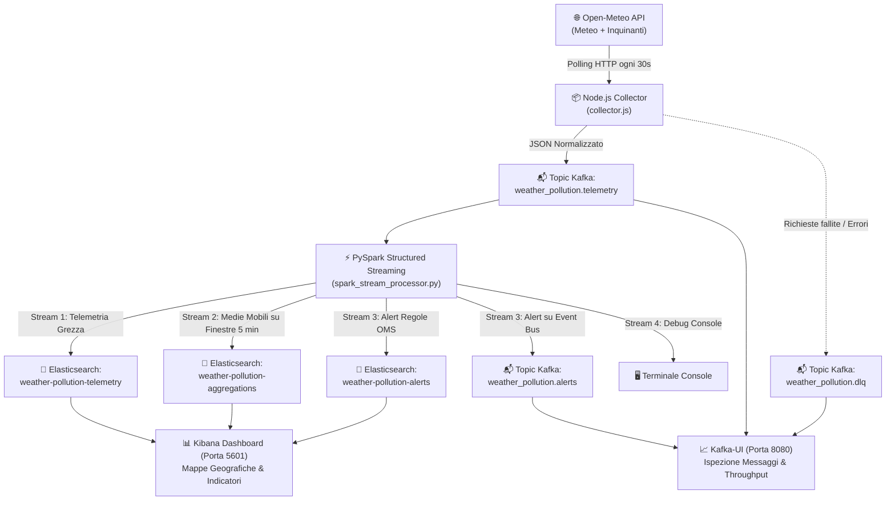

# 📘 Guida Completa all'Architettura e al Codice del Progetto TAP
## Real-Time Weather & Air Quality Monitoring Pipeline

Questo documento descrive in modo esaustivo l'architettura, le tecnologie, le scelte progettuali e il funzionamento dettagliato **riga per riga** di ogni singolo modulo della pipeline Big Data.

---

## 📑 Indice dei Contenuti
1. [Panoramica dell'Architettura Globale](#1-panoramica-dellarchitettura-globale)
2. [Modulo Ingestion: `collector/collector.js`](#2-modulo-ingestion-collectorcollectorjs)
3. [File di Configurazione del Collector (`cities.json`, `.env`, `Dockerfile`)](#3-file-di-configurazione-del-collector)
4. [Modulo Stream Processing: `spark/spark_stream_processor.py`](#4-modulo-stream-processing-sparkspark_stream_processorpy)
5. [Modulo Machine Learning: `spark/spark_ml_anomaly_detector.py`](#5-modulo-machine-learning-sparkspark_ml_anomaly_detectorpy-fase-4)
6. [Modulo Kibana & Visualizzazioni: `kibana/setup_kibana.py`](#6-modulo-kibana--visualizzazioni-kibanasetup_kibanapy-fase-5)
7. [Orchestrazione del Cluster: `docker-compose.yml`](#7-orchestrazione-del-cluster-docker-composeyml)
8. [Manuale Operativo di Avvio e Monitoraggio](#8-manuale-operativo-di-avvio-e-monitoraggio)

---

## 1. Panoramica dell'Architettura Globale

La pipeline realizza un flusso di elaborazione dati distribuito e in tempo reale per monitorare i parametri meteorologici e gli inquinanti atmosferici (PM2.5, PM10, AQI, $NO_2$, $SO_2$, $CO$, $O_3$) in diverse città italiane ed europee.



---

## 2. Modulo Ingestion: `collector/collector.js`

Il file `collector.js` è un microservizio scritto in **Node.js (JavaScript ES Modules)** incaricato di prelevare i dati dalle API esterne, normalizzarli e pubblicarli sul broker Apache Kafka.

### Sezione 1: Importazione dei Moduli e Setup
```javascript
import { Kafka, logLevel } from "kafkajs";
import fs from "fs";
import path from "path";
import { fileURLToPath } from "url";
import dotenv from "dotenv";
dotenv.config();
```
* **`kafkajs`**: Client ufficiale Kafka ad alte prestazioni per Node.js.
* **`fs` e `path`**: Moduli nativi per la lettura dei file su disco (`cities.json`).
* **`fileURLToPath` e `import.meta.url`**: Negli standard moderni ES Modules (`"type": "module"`), le variabili `__dirname` e `__filename` non sono presenti di default; vengono ricreate in modo pulito e cross-platform.
* **`dotenv.config()`**: Carica le variabili definite nel file `.env` dentro `process.env`.

---

### Sezione 2: Variabili d'Ambiente e Configurazione
```javascript
const KAFKA_BROKERS = (process.env.KAFKA_BROKERS || "localhost:9092").split(",");
const KAFKA_CLIENT_ID = process.env.KAFKA_CLIENT_ID || "weather-pollution-collector";
const TELEMETRY_TOPIC = process.env.KAFKA_TOPIC_TELEMETRY || "weather_pollution.telemetry";
const DLQ_TOPIC = process.env.KAFKA_TOPIC_DLQ || "weather_pollution.dlq";
const POLL_INTERVAL_MS = (parseInt(process.env.POLL_INTERVAL_SEC, 10) || 30) * 1000;
const DRY_RUN = process.env.DRY_RUN === "true";
const CITIES_PATH = process.env.CITIES_FILE || path.join(__dirname, "cities.json");
```
* Permette di configurare l'indirizzo del broker Kafka (`kafka:9092` in Docker, `localhost:9092` in locale), i topic di destinazione, e la frequenza di polling.
* **`DRY_RUN`**: Se impostato a `true`, i dati vengono stampati su console senza richiedere una connessione Kafka attiva (ottimo per il debug locale).

---

### Sezione 3: Caricamento Città (`cities.json`)
```javascript
let cities = [];
try {
  const citiesData = fs.readFileSync(CITIES_PATH, "utf-8");
  cities = JSON.parse(citiesData);
} catch (err) {
  process.exit(1);
}
```
* Legge sincronicamente all'avvio l'elenco delle città da monitorare. Se il file non esiste o è corrotto, termina il processo con codice di errore `1` per evitare esecuzioni a vuoto.

---

### Sezione 4: Inizializzazione Client e Producer Kafka
```javascript
let producer = null;
if (!DRY_RUN) {
  const kafka = new Kafka({
    clientId: KAFKA_CLIENT_ID,
    brokers: KAFKA_BROKERS,
    logLevel: logLevel.WARN,
    retry: { initialRetryTime: 300, retries: 10 }
  });
  producer = kafka.producer();
}
```
* Crea l'oggetto `producer`.
* La configurazione `retry` garantisce che, se Kafka è in fase di avvio nei container Docker, il client effettui fino a 10 tentativi automatici di riconnessione con backoff esponenziale.

---

### Sezione 5: Fetch e Normalizzazione dei Dati (`fetchCityData`)
```javascript
async function fetchCityData(cityInfo) {
  const { city, country, lat, lon } = cityInfo;
  const weatherUrl = `https://api.open-meteo.com/v1/forecast?...`;
  const airQualityUrl = `https://air-quality-api.open-meteo.com/v1/air-quality?...`;

  const [weatherRes, airRes] = await Promise.all([
    fetch(weatherUrl),
    fetch(airQualityUrl)
  ]);
  // ... parsing e costruzione del payload normalizzato
}
```
* **`Promise.all`**: Esegue le due chiamate HTTP (Meteo + Qualità dell'Aria) in **parallelo**, dimezzando la latenza di rete.
* **Costruzione del Payload Normalizzato**:
  * `@timestamp`: Formato standard ISO 8601 UTC (`"2026-10-07T15:30:00.000Z"`).
  * `location: { lat, lon }`: Struttura standard richiesta da Elasticsearch come tipo `geo_point` per abilitare le mappe su Kibana.
  * Operatore `?? null` (*Nullish Coalescing*): Evita che il valore `0°C` o vento `0 km/h` venga convertito erroneamente in `null`.

---

### Sezione 6: Invio dei Dati a Kafka e Dead Letter Queue (`collectAndProduce`)
```javascript
const results = await Promise.allSettled(
  cities.map(async (cityInfo) => {
    // invio con key = cityInfo.city
    await producer.send({
      topic: TELEMETRY_TOPIC,
      messages: [{ key: cityInfo.city, value: JSON.stringify(payload) }]
    });
  })
);
```
* **`Promise.allSettled`**: Garantisce che se una singola città fallisce per problemi di rete, le altre 11 vengano comunque scaricate e inviate regolarmente.
* **`key: cityInfo.city`**: In Kafka, assegnare la città come chiave garantisce che tutti i dati relativi a quella città vadano nella **stessa partizione**, mantenendo l'ordine cronologico per i calcoli temporali in PySpark.
* In caso di errore irreversibile, l'evento fallito viene inoltrato al topic `weather_pollution.dlq` (Dead Letter Queue).

---

### Sezione 7: Ciclo Periodico e Graceful Shutdown
```javascript
await collectAndProduce(); // Primo ciclo immediato
const intervalId = setInterval(collectAndProduce, POLL_INTERVAL_MS);

const gracefulShutdown = async (signal) => {
  clearInterval(intervalId);
  if (producer) await producer.disconnect();
  process.exit(0);
};
process.on("SIGINT", () => gracefulShutdown("SIGINT"));
process.on("SIGTERM", () => gracefulShutdown("SIGTERM"));
```
* Pianifica il polling a intervalli regolari.
* Intercetta i segnali di stop (`SIGINT` da terminale o `SIGTERM` da Docker), disconnette Kafka in modo pulito e svuota i buffer di rete.

---

## 3. File di Configurazione del Collector

### `collector/cities.json`
Array di oggetti contenente i metadati geografici delle città monitorate:
```json
[
  { "city": "Catania", "country": "IT", "lat": 37.5079, "lon": 15.0873 },
  { "city": "Palermo", "country": "IT", "lat": 38.1157, "lon": 13.3615 },
  { "city": "Milano", "country": "IT", "lat": 45.4642, "lon": 9.1900 },
  ...
]
```

### `collector/.env`
File contenente i parametri di configurazione modificabili senza ricompilare il codice:
```ini
KAFKA_BROKERS=localhost:9092
KAFKA_CLIENT_ID=weather-pollution-collector
KAFKA_TOPIC_TELEMETRY=weather_pollution.telemetry
KAFKA_TOPIC_DLQ=weather_pollution.dlq
POLL_INTERVAL_SEC=30
DRY_RUN=false
```

### `collector/Dockerfile`
Immagine Docker ultraleggera basata su `node:22-alpine` per l'esecuzione del Collector come microservizio containerizzato.

---

## 4. Modulo Stream Processing: `spark/spark_stream_processor.py`

Il processore PySpark è il motore computazionale del progetto. Legge lo stream continuo da Kafka, esegue calcoli statistici su finestre temporali, applica regole di allarme OMS e invia i risultati a Elasticsearch e Kafka.

### Sezione 1 & 2: Variabili, Logging e Pre-configurazione Indici Elasticsearch
```python
def init_elasticsearch_indices():
    # Invia la PUT con mapping geo_point per i 3 indici:
    # 1. weather-pollution-telemetry
    # 2. weather-pollution-aggregations
    # 3. weather-pollution-alerts
```
* Prima che gli stream partano, verifica se gli indici Elasticsearch esistono già; se mancano, applica un mapping esplicito per fare in modo che `location` sia riconosciuto come `geo_point` per Kibana Maps.

---

### Sezione 3: Creazione della `SparkSession`
```python
def create_spark_session():
    packages = ["org.apache.spark:spark-sql-kafka-0-10_2.12:3.5.1"]
    spark = (
        SparkSession.builder
        .appName("WeatherPollutionStreamProcessor")
        .master(os.getenv("SPARK_MASTER", "local[*]"))
        .config("spark.jars.packages", ",".join(packages))
        .config("spark.sql.shuffle.partitions", "3")
        .getOrCreate()
    )
    return spark
```
* **`spark-sql-kafka-0-10`**: Pacchetto Maven necessario per abilitare `readStream` e `writeStream` con Kafka.
* **`spark.sql.shuffle.partitions = 3`**: Ottimizzazione cruciale per lo streaming locale: riduce il numero di partizioni di default da 200 a 3, abbattendo la latenza di calcolo delle medie a pochi millisecondi.

---

### Sezione 4: Definizione dello Schema Fortemente Tipizzato
```python
telemetry_schema = StructType([
    StructField("@timestamp", TimestampType(), True),
    StructField("city", StringType(), True),
    StructField("country", StringType(), True),
    StructField("location", StructType([
        StructField("lat", DoubleType(), True),
        StructField("lon", DoubleType(), True)
    ]), True),
    StructField("temperature_c", DoubleType(), True),
    StructField("pm2_5", DoubleType(), True),
    StructField("pm10", DoubleType(), True),
    StructField("european_aqi", DoubleType(), True),
    ...
])
```
* Definisce i tipi esatti di ciascun campo JSON. Spark utilizza questo schema per deserializzare in modo efficiente il flusso binario di Kafka.

---

### Sezione 5: Helper `write_to_elasticsearch` con Bulk API REST
```python
def write_to_elasticsearch(batch_df, batch_id, index_name):
    # Converte il micro-batch in NDJSON e invia una POST su http://elasticsearch:9200/_bulk
```
* Utilizza la **Bulk API REST** (`_bulk`) di Elasticsearch per inviare decine di record per micro-batch in un'unica richiesta HTTP efficiente e non bloccante.

---

### Sezione 6: I 4 Flussi di Stream Processing Paralleli

#### 🔹 Stream 1: Telemetria Diretta su Elasticsearch
* Prende i dati grezzi normalizzati non appena arrivano da Kafka e li inserisce nell'indice `weather-pollution-telemetry` (trigger ogni 10s).

#### 🔹 Stream 2: Medie Mobili e Aggregazioni su Finestre (Windowing)
```python
aggregated_stream = (
    telemetry_stream
    .withWatermark("@timestamp", "2 minutes")
    .groupBy(
        window(col("@timestamp"), "5 minutes", "1 minute"),
        col("city"),
        col("country")
    )
    .agg(
        avg("pm2_5").alias("avg_pm2_5"),
        avg("pm10").alias("avg_pm10"),
        avg("temperature_c").alias("avg_temperature_c"),
        max("european_aqi").alias("max_european_aqi"),
        count(lit(1)).alias("sample_count")
    )
)
```
* **Watermark (2 minuti)**: Gestisce eventuali dati che arrivano in ritardo a causa di latenze di rete.
* **Sliding Window (5 minuti con passo di 1 minuto)**: Calcola la media mobile continua per ogni città e scrive i risultati su `weather-pollution-aggregations` (modalità `update`).

#### 🔹 Stream 3: Allarmi Ambientali Basati su Regole OMS/UE
```python
alerts_stream = (
    telemetry_stream
    .filter(
        (col("pm2_5") > 25.0) |
        (col("pm10") > 50.0) |
        (col("european_aqi") > 50.0)
    )
    .withColumn("alert_level", 
        when((col("pm2_5") > 50.0) | (col("pm10") > 100.0) | (col("european_aqi") > 80.0), "CRITICAL")
        .otherwise("WARNING")
    )
    .withColumn("alert_reason", ...)
)
```
* Rileva i superamenti dei limiti sanitari per PM2.5, PM10 e AQI.
* Classifica la gravità in `WARNING` o `CRITICAL`.
* Invia gli allarmi a:
  1. **Elasticsearch** (`weather-pollution-alerts`) per le dashboard.
  2. **Topic Kafka** (`weather_pollution.alerts`) per eventuali altri microservizi o notifiche downstream.

#### 🔹 Stream 4: Output Console
* Stampa in tempo reale gli allarmi sulla console terminale per il monitoraggio visivo immediato durante l'esecuzione.

---

## 5. Modulo Machine Learning: `spark/spark_ml_anomaly_detector.py` (Fase 4)

Il modulo di Machine Learning con **PySpark MLlib** individua comportamenti anomali dell'aria incrociando i dati meteorologici con i livelli di inquinamento.

### 🧠 Architettura della Pipeline ML
1. **Features utilizzate**:
   * Parametri ambientali: `temperature_c`, `humidity_pct`, `wind_speed_kmh`
   * Inquinanti: `pm2_5`, `pm10`, `no2`, `european_aqi`
2. **Componenti della Pipeline**:
   * **`VectorAssembler`**: compatta le 7 feature numeriche in un vettore continuo.
   * **`StandardScaler`**: standardizza a media zero e varianza unitaria ($Z\text{-score}$) per evitare che variabili con scale diverse sbilancino la distanza euclidea.
   * **`KMeans(k=3)`**: divide lo spazio delle feature in 3 cluster:
     * *Cluster 0*: Aria Pulita / Ottimale
     * *Cluster 1*: Inquinamento Moderato
     * *Cluster 2*: Inquinamento Elevato / Critico
3. **Calcolo dell'Anomaly Score in Streaming**:
   * Per ciascun record in arrivo da Kafka, viene calcolata la distanza euclidea $D = \|\mathbf{x} - \mathbf{c}_k\|$ dal centroide $\mathbf{c}_k$ del cluster assegnato.
   * Se $D > \text{Threshold}$ (default `2.8`), il record viene contrassegnato con `is_anomaly = true`.
4. **Sink dei risultati**:
   * Scrive i dati arricchiti su Elasticsearch (`weather-pollution-ml-alerts`) e sul topic Kafka `weather_pollution.ml-alerts`.

---

## 6. Modulo Kibana & Visualizzazioni: `kibana/setup_kibana.py` (Fase 5)

Lo script automatizza l'importazione e la configurazione degli asset visivi su Kibana tramite le API REST Saved Objects.

### 📊 Risorse Create Automaticamente:
1. **Data Views (Index Patterns)**:
   * `weather-pollution-telemetry*` (timestamp: `@timestamp`)
   * `weather-pollution-aggregations*` (timestamp: `@timestamp`)
   * `weather-pollution-alerts*` (timestamp: `@timestamp`)
   * `weather-pollution-ml-alerts*` (timestamp: `@timestamp`)
2. **Dashboard Principale**: *"🌍 TAP: Real-Time Weather & Pollution Live Monitor"*:
   * **Mappa Geospaziale (Kibana Maps)**: coordinate `location` (`geo_point`) colorate per severità AQI.
   * **Grafici Temporali (Lens Time-Series)**: andamento PM2.5/PM10 confrontato con Temperatura e Vento.
   * **Pannello Allarmi Live**: tabella dinamica degli allarmi OMS e anomalie ML.

---

## 7. Orchestrazione del Cluster: `docker-compose.yml`

Il file `docker-compose.yml` orchestra **10 servizi distribuiti** sulla rete interna bridge `tap-network`:

| Container | Immagine | Porte Esposte | Scopo |
| :--- | :--- | :--- | :--- |
| **`tap-zookeeper`** | `confluentinc/cp-zookeeper:7.5.0` | `2181` | Coordinatore di cluster Kafka |
| **`tap-kafka`** | `confluentinc/cp-kafka:7.5.0` | `9092`, `29092` | Message Broker distribuito |
| **`tap-kafka-init-topics`** | `confluentinc/cp-kafka:7.5.0` | - | Creazione automatica dei 4 topic con 3 partizioni |
| **`tap-kafka-ui`** | `provectuslabs/kafka-ui:latest` | `8080` | Interfaccia web di ispezione code |
| **`tap-elasticsearch`** | `elasticsearch:8.12.0` | `9200` | Database per serie temporali e geopoint |
| **`tap-kibana`** | `kibana:8.12.0` | `5601` | Dashboard di visualizzazione e mappe |
| **`tap-collector`** | *Build da `./collector`* | - | Microservizio Ingestion Node.js |
| **`tap-spark-processor`** | *Build da `./spark`* | - | Motore PySpark Streaming (Medie e Allarmi) |
| **`tap-spark-ml`** | *Build da `./spark`* | - | Motore PySpark MLlib Anomaly Detection |
| **`tap-kibana-init`** | `python:3.11-slim` | - | Inizializzazione automatica Dashboard Kibana |

---

## 8. Manuale Operativo di Avvio e Monitoraggio

### 🚀 1. Avvio dell'intero cluster
Dalla cartella principale del progetto, eseguire:
```bash
docker compose up -d --build
```

### 📋 2. Verifica dello stato dei container
```bash
docker compose ps
```

### 🔍 3. Controllo dei log in tempo reale
* **Log del Collector**:
  ```bash
  docker logs -f tap-collector
  ```
* **Log di PySpark Processor**:
  ```bash
  docker logs -f tap-spark-processor
  ```
* **Log di PySpark ML Anomaly Detector**:
  ```bash
  docker logs -f tap-spark-ml
  ```

### 🌐 4. Accesso alle Dashboard Web
* **Kafka-UI**: [http://localhost:8080](http://localhost:8080) (per visualizzare i messaggi nei topic `telemetry`, `alerts` e `ml-alerts`).
* **Kibana Dashboard**: [http://localhost:5601](http://localhost:5601) (per visualizzare la dashboard e le mappe dei sensori).
* **Elasticsearch REST**: [http://localhost:9200/_cat/indices?v](http://localhost:9200/_cat/indices?v) (per controllare i conteggi dei documenti negli indici).

### 🛑 5. Arresto del cluster
```bash
docker compose down
```
*(Per cancellare anche i volumi di storage: `docker compose down -v`)*
