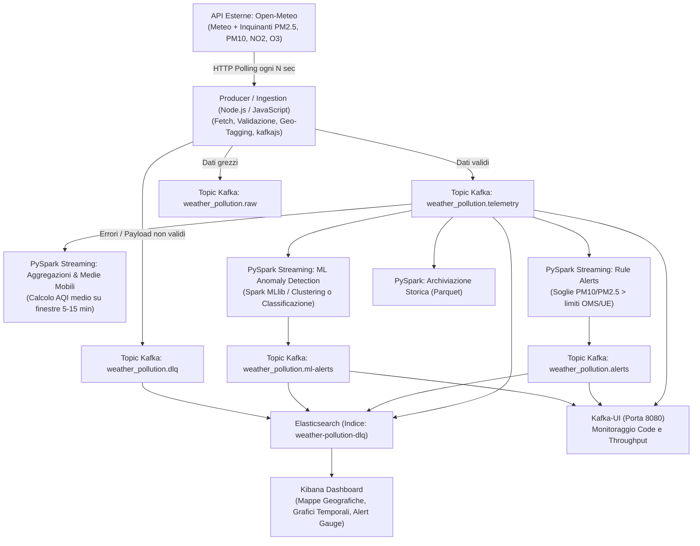

# Progetto TAP: Real-Time Weather & Air Quality Monitoring Pipeline

## 📌 Panoramica del Progetto
Questo progetto realizza una pipeline **Big Data & Real-Time Stream Processing end-to-end** per il monitoraggio continuo di **meteo e qualità dell'aria (inquinamento)** in diverse città italiane ed europee.

L'architettura è sviluppata per il corso di **Technologies for Advanced Programming (TAP - 9 CFU, UniCT)** tenuto dal Prof. Salvatore Nicotra.

---

## 🏗️ Architettura della Pipeline



---

## 🛠️ Stack Tecnologico
* **Data Ingestion**: Node.js 20+ (JavaScript ES Modules, `kafkajs`)
* **Message Broker**: Apache Kafka + Zookeeper (o Kafka KRaft) + Kafka-UI
* **Stream Processing & Machine Learning**: Apache Spark (PySpark Structured Streaming + Spark MLlib)
* **Storage & Indexing**: Elasticsearch 8.x + Storage Parquet
* **Visualizzazione**: Kibana 8.x
* **Orchestrazione**: Docker & Docker Compose

---

## 🌐 Sorgente Dati Selezionata: Open-Meteo API
* **Vantaggi**: Gratuita al 100%, non richiede API Key, alta affidabilità, formati JSON standard.
* **Endpoint Qualità Aria**:
  `https://air-quality-api.open-meteo.com/v1/air-quality?latitude=37.50&longitude=15.09&current=pm10,pm2_5,carbon_monoxide,nitrogen_dioxide,sulphur_dioxide,ozone,european_aqi`
* **Endpoint Meteo**:
  `https://api.open-meteo.com/v1/forecast?latitude=37.50&longitude=15.09&current=temperature_2m,relative_humidity_2m,surface_pressure,wind_speed_10m`
* **Città Monitorate (Esempio)**:
  * Catania (37.50, 15.09)
  * Palermo (38.12, 13.36)
  * Roma (41.89, 12.49)
  * Milano (45.46, 9.19)
  * Napoli (40.85, 14.27)
  * Torino (45.07, 7.68)

---

## 📑 Roadmap di Implementazione (Fase per Fase)

### ✅ Fase 1: Data Ingestion & Collector (Punto di partenza attuale)
* Creare lo script `collector.py` (o configurazione Logstash) per interrogare le API Open-Meteo per le città target.
* Normalizzare i campi in un payload JSON pulito:
  ```json
  {
    "@timestamp": "2026-09-30T16:45:00Z",
    "city": "Catania",
    "country": "IT",
    "location": { "lat": 37.50, "lon": 15.09 },
    "temperature_c": 22.4,
    "humidity_pct": 65.0,
    "pressure_hpa": 1013.2,
    "wind_speed_kmh": 12.5,
    "pm2_5": 14.2,
    "pm10": 28.5,
    "no2": 18.0,
    "so2": 3.1,
    "co": 210.0,
    "o3": 45.0,
    "european_aqi": 35
  }
  ```
* Pubblicare i dati su Kafka (`weather_pollution.telemetry`).

### 🔜 Fase 2: Configurazione Infrastruttura Docker
* Creare `docker-compose.yml` con:
  * Zookeeper & Kafka
  * Kafka-UI (porta 8080)
  * Elasticsearch (porta 9200)
  * Kibana (porta 5601)
  * Servizio Collector/Ingestion

### 🔜 Fase 3: Stream Processing con PySpark
* `spark_stream_aggregations.py`: Medie mobili di PM10 e PM2.5 calcolate su finestre di 10 minuti per città.
* `spark_stream_alerts.py`: Regole di allarme basate sui limiti OMS (es. PM2.5 > 25 µg/m³ o European AQI > 50).

### 🔜 Fase 4: Machine Learning (Anomaly Detection)
* Addestramento di un modello PySpark MLlib (es. KMeans per clustering di qualità dell'aria o Isolation Forest / Random Forest per anomalie di inquinamento anomalo rispetto alle condizioni meteo).
* Inferenza in streaming su PySpark Structured Streaming.

### 🔜 Fase 5: Dashboard Kibana & Presentazione
* Creazione di mappe con geolocalizzazione dei sensori per città.
* Grafici temporali per andamento PM2.5 / PM10 vs Temperatura e Vento.
* Tabelle e indicatori per gli alert in tempo reale.
